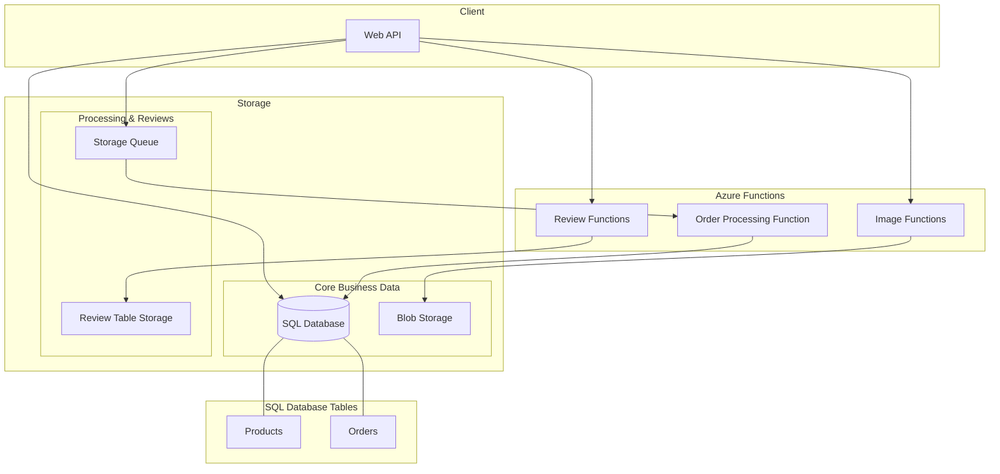
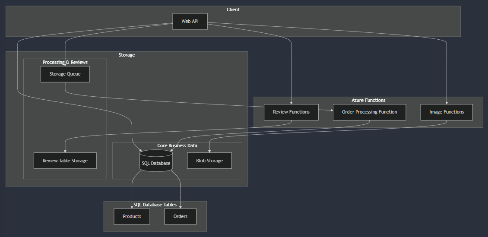

# Widget & Co Store

> [!IMPORTANT]  
> Final grade: 10/10

> [!NOTE]
> <br>This project is also hosted on GitHub. See the repository [here](https://github.com/SemPlaatsman/WidgetCo.Store)

This is a proof of concept project demonstrating cloud database usage in Azure. The solution consists of an API project and an Azure Functions project, utilizing various Azure services including SQL Database, Table Storage, Queue Storage, and Blob Storage.

## Deployment Status

A deployment attempt was made with the following endpoints:

- API URL: https://widgetco-api-gceebgf0f0cyceaw.northeurope-01.azurewebsites.net/
- Functions URL: https://widgetco-functions.azurewebsites.net/

However, some issues were encountered during deployment and configuration:
- Functions were not accessible through their endpoints
- Some configuration settings may need adjustment
- Further investigation is needed for proper service communication

These issues are typical in a proof of concept project and demonstrate the real-world challenges of cloud deployment and configuration.

## Architecture


<details>
<summary>If the mermaid file does not render in your Markdown renderer, open this to show the PNG!</summary>



</details>

You can also checkout the mermaid chart file [here](./docs/architecture.mmd). 

## Architecture Design Rationale

The application uses Azure Functions for three specific components, each chosen for distinct reasons:

### Review Functions
Reviews are handled by serverless functions because:
1. **Anonymous Access**: The project requires anonymous product reviews, making it ideal to separate this from the main authenticated application
2. **Separate Storage**: Reviews are stored in Table Storage rather than SQL as they're intended for future marketing analysis, not core business operations
3. **Scalability**: Review submission patterns can be unpredictable and spiky, making serverless functions ideal for cost-effective scaling
4. **Future Analytics**: Since reviews will be used for product range profiling later, having them in Table Storage with Azure Functions makes it easier to integrate with future analytics services

### Order Processing Function
Order processing is implemented as a queue-triggered function because:
1. **Peak Performance**: As noted in the project requirements, order placement was "the main culprit in sluggish performance"
2. **Asynchronous Processing**: Using a queue-triggered function allows the API to quickly accept orders and respond to users while processing happens asynchronously
3. **Load Leveling**: The queue acts as a buffer during peak hours, preventing the database from being overwhelmed
4. **Reliability**: Queue storage ensures no orders are lost even during high load periods

### Image Functions
Product images are handled by separate functions because:
1. **Resource Intensive**: Image processing and storage operations can be computationally expensive
3. **Specialized Storage**: Images are stored in Blob Storage, which is optimized for large binary files
4. **Independent Scaling**: Image processing can scale independently of the main application
5. **Cost Optimization**: Since image operations are infrequent, serverless functions prevent paying for idle resources

This architecture aligns with the project requirements of:
- Handling heavy loads at peak hours
- Improving the order placement process
- Supporting anonymous product reviews
- Separating review data for future marketing analysis
- Managing product images efficiently

Each function type is designed to handle specific concerns independently, allowing for better scalability, maintenance, and cost management in the cloud environment.

## Project Structure

- `Api/` - Web API project
- `Functions/` - Azure Functions project
  - `OrderProcessingFunction` - Handles order processing from queue
  - `ProductImageFunction` - Manages product images
  - `ReviewFunction` - Manages product reviews
- `Core/` - Core domain logic
- `Infrastructure/` - Implementation logic and services
- `deployment/` - Azure deployment scripts

## API Endpoints

See also:
- [orders.http](./docs/http/orders.http)
- [products.http](./docs/http/products.http)

### Products API
- `[GET] /api/products` - Get all products
- `[GET] /api/products/{productId}` - Get a specific product
- `[POST] /api/products` - Create a new product
- `[PUT] /api/products/{productId}` - Update an existing product

### Orders API
- `[POST] /api/orders` - Create a new order
- `[GET] /api/orders/{orderRequestId}` - Get order status
- `[POST] /api/orders/{orderId}/ship` - Ship an order

## Function Endpoints
See also:
- [images.http](./docs/http/images.http)
- [reviews.http](./docs/http/reviews.http)

### Review Functions
- `[POST] /api/reviews` - Add a new product review
- `[GET] /api/reviews/{productId}` - Get reviews for a specific product

### Product Image Functions
- `[GET] /api/images` - Get all product images
- `[POST] /api/images` - Upload a new product image

### Order Processing
- Queue trigger function that processes orders from the order-processing queue

## API Testing

### HTTP Files
The [`docs/http`](./docs/http) folder contains HTTP files for testing the API endpoints using tools like Visual Studio Code's REST Client or JetBrains' HTTP Client:
- [`products.http`](./docs/http/products.http) - Product-related endpoints
- [`orders.http`](./docs/http/orders.http) - Order-related endpoints
- [`images.http`](./docs/http/images.http) - (Product) Image-related endpoints
- [`reviews.http`](./docs/http/reviews.http) - Review-related endpoints

### Insomnia Export
For testing with Insomnia REST Client, an export file is provided in the [`docs/insomnia`](./docs/insomnia) folder. To use it:

1. Open Insomnia
2. Go to `Application > Preferences > Data > Import Data`
3. Select "From File"
4. Navigate to [`docs/insomnia/WidgetCo-Store.json`](./docs/insomnia/WidgetCo-Store.json)
5. All endpoints will be imported with:
   - Environment configurations (Development/Production)
   - Example requests
   - Request body templates

The export includes all API and Function endpoints with proper configurations for both local development and Azure environments.

## Azure Resources

This project uses the following Azure resources:
- Azure SQL Database (for main data storage)
  - Products table
  - Orders table
- Azure Table Storage (for product reviews)
- Azure Queue Storage (for order processing)
- Azure Blob Storage (for product images)
- Azure App Service (for hosting the API)
- Azure Functions (for serverless operations)

### Azure Resource Tiers

This proof of concept uses cost-effective service tiers:

- **App Service Plan**: Basic (B1)
  - Suitable for development and light production loads
  - 1 core, 1.75 GB RAM
  - Supports both the Web API and Function Apps
- **SQL Database**: Basic
  - 2 GB storage
  - Good for development and small applications
- **Storage Account**: Standard LRS (Locally Redundant Storage)
  - Cost-effective storage option
  - Suitable for non-critical data

> [!NOTE]
> These tiers are chosen for proof of concept purposes. For production use, consider:
> - Standard tier (S1) or higher for App Service Plan if higher performance is needed
> - Standard tier for SQL Database for better performance and larger data capacity
> - Zone-redundant or geo-redundant storage for better data protection

## Deployment

### Prerequisites
- Azure CLI installed
- PowerShell or Bash shell
- An Azure subscription
- .NET 8.0 SDK

### Deployment Scripts

The `deployment` folder contains scripts to set up all required Azure resources:
- [`deploy.ps1`](./deployment/deploy.ps1) - PowerShell deployment script
- [`deploy.sh`](./deployment/deploy.sh) - Bash deployment script

To deploy the infrastructure:

1. Navigate to the deployment folder:
```bash
cd deployment
```

2. Run either the PowerShell or Bash script:
```powershell
# PowerShell
.\deploy-azure.ps1
```
```bash
# Bash
./deploy-azure.sh
```

The scripts will:
1. Create a resource group
2. Set up all required Azure services
3. Configure connection strings and application settings
4. Set up proper authentication and security rules

### Manual Configuration

After running the deployment scripts:
1. Update your application's connection strings in both projects
2. Deploy your application code through Visual Studio or GitHub Actions
3. Run database migrations
4. Test the endpoints

## Infrastructure as Code

### Bicep Deployment
The [`deployment/bicep`](./deployment/bicep) folder contains Bicep templates for Azure resource deployment:

- [`main.bicep`](./deployment/bicep/main.bicep) - Main deployment template
- [`modules/`](./deployment/bicep/modules)
  - [`storage.bicep`](./deployment/bicep/modules/storage.bicep) - Storage account, containers, queues, and tables
  - [`sql.bicep`](./deployment/bicep/modules/sql.bicep) - SQL Server and database
  - [`app-service.bicep`](./deployment/bicep/modules/app-service.bicep) - App Service Plan, Web App, and Function App

To deploy using Bicep:

1. Login to Azure CLI:
```bash
az login
```

2. Deploy the resources:
```bash
az deployment sub create \
  --location northeurope \
  --template-file deployment/bicep/main.bicep \
  --parameters environmentName=prod
```

The Bicep templates will create all necessary Azure resources with proper configurations and connections.

> [!IMPORTANT]
> Before deployment:
> - Update the SQL administrator password in `main.bicep`
> - Review the SKUs and pricing tiers in the templates
> - Consider using Azure Key Vault for sensitive values in production

## Development

### Local Development Prerequisites
- Visual Studio 2022
- .NET 8.0 SDK
- Azure Storage Emulator
- SQL Server (LocalDB or full installation)

### Configuration Files
- `appsettings.json` - API project configuration
- `local.settings.json` - Functions project configuration

### Local Development Setup
1. Clone the repository
2. Open the solution in Visual Studio 2022
3. Update connection strings in configuration files
4. Run database migrations
5. Start both the API and Functions projects

## Cloud Databases Demonstration

This project showcases various cloud database technologies:
1. **Relational Data** - Azure SQL Database for structured data
2. **NoSQL Data** - Table Storage for product reviews
3. **Queue Storage** - For asynchronous order processing
4. **Blob Storage** - For storing product images

## Notes

- This is a proof of concept project
- Some security features are simplified for demonstration
- Local development uses development storage emulators
- Production deployment uses full Azure services
- Deployment issues were encountered and documented for learning purposes
